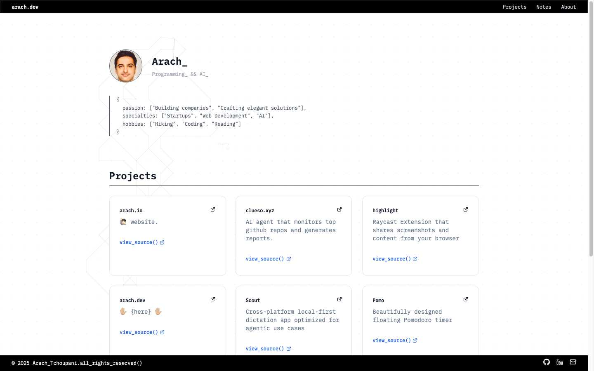

# arach.dev

Personal developer portfolio website showcasing projects and skills.



## Overview

A modern, terminal-inspired portfolio website built with Next.js 14, TypeScript, and Tailwind CSS. Features interactive background animations, project showcases, and a clean dark theme.

## Tech Stack

- **Framework**: Next.js 14.2.4 with App Router
- **Language**: TypeScript
- **Styling**: Tailwind CSS with custom animations
- **UI Components**: shadcn/ui
- **Animations**: Framer Motion
- **Font**: IBM Plex Mono

## Getting Started

First, install dependencies:

```bash
pnpm install
```

Then, run the development server:

```bash
pnpm dev
```

Open [http://localhost:3000](http://localhost:3000) with your browser to see the result.

## Project Structure

```
/app              # Next.js App Router pages and layouts
/components       # Reusable React components
  /ui            # shadcn/ui components
  /home          # Homepage-specific components
/lib             # Utilities and shared code
/public          # Static assets
```

## Features

- Interactive node-based background animation
- Terminal-inspired aesthetic
- Project showcase with GitHub links
- Responsive design
- Typewriter text effects
- Dark theme with custom gray color palette

## Deployment

The site can be deployed on any platform that supports Next.js applications, such as Vercel, Netlify, or similar services.

## License

© 2025 Arach Tchoupani. All rights reserved.